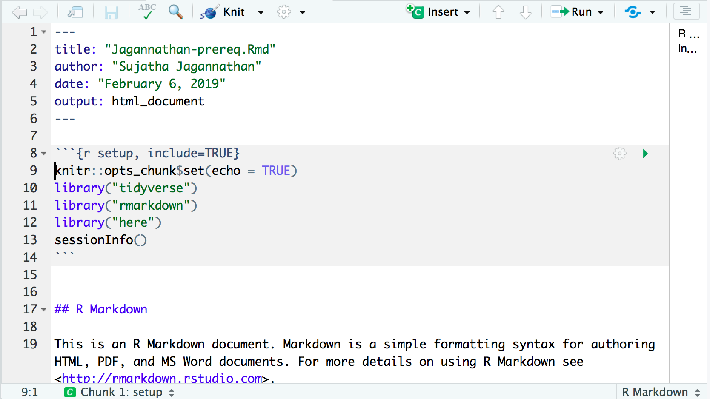
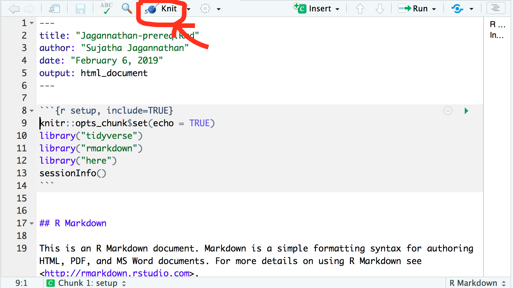

## R Set up
The goal of this pre-class assignment is to make sure that you:  

A) Install R
B) Install Rstudio
C) Install `tidyverse`, `rmarkdown`, and `here` packages 
D) Create a new Rmarkdown document (lastname-prereq.rmd) - more about this later
E) Knit the .Rmd document and submit the resulting .html file as your pre-class assignment

Doing all of the above is *necessary* to hit the ground running in your first class. 

#### A) Install R
Download the latest release of R from The Comprehensive R Archive Network, or [CRAN](https://cran.rstudio.com/), for short. Choose the right version for your operating system and follow the directions. 

#### B) Install Rstudio
Rstudio is an Integrated Development Environment (IDE) for R. Download the free version of RStudio Desktop from this [link](https://www.rstudio.com/products/rstudio/download/#download) by choosing the appropriate installer file for your operating system. 

#### C) Install tidyverse and rmarkdown
`*`**Important**`*` Before you do this step, you need to familiarize yourself with the Rstudio window. Now would be a good time to peruse this [tutorial](https://swcarpentry.github.io/r-novice-gapminder/01-rstudio-intro/) to get a working familiarity of Rstudio.   

Once you have done that, go ahead and click on the Rstudio icon to open a new Rstudio window. It usually looks like this:


The console is where you type your code and usually the output appears right there. If you are generating a plot, it would show in the bottom right "plots" area. The following image shows a minimal "parts list" of the Rstudio window.   


Now that you know where the code goes, type the following lines into the console:  
```{r setup, include=TRUE, eval=FALSE}
r = getOption("repos")
r["CRAN"] = "http://cran.us.r-project.org"
options(repos = r)
install.packages("tidyverse")
install.packages("rmarkdown")
install.packages("here")
```
  
#### D) Create a new Rmarkdown document (lastname-prereq.rmd) 
Now that your R environment is set up (or should be set up), let's check that this is the case.   

1. Click on: File > New File > R Markdown    


2. Enter a title (yourlastname-prereq.rmd) and keep the output format to html    

3. You should be looking at a file like this     


4. Within the first code chunk (the grey boxed area between lines 8-10), enter the following as new lines. Change the option "include=FALSE" to "include=TRUE". 

```{r eval=FALSE}
library("tidyverse")
library("rmarkdown")
library("here")
sessionInfo()
```  
Like so.   

  Note: Feel free to delete everything below the first code chunk.   

5. Save the document as yourlastname-prereq.Rmd     

#### E) Knit the .Rmd document and submit the resulting .html file as your pre-class assignment  
This is the simple stuff. Click on the "knit" button.   


Upload the html output (which should show up in whichever folder you keep the .Rmd file) to Canvas. This is your preclass assignment.   


## Acknowledgements

I have borrowed content heavily from the [Rstudio website](https://www.rstudio.com/products/rstudio/features/). 
